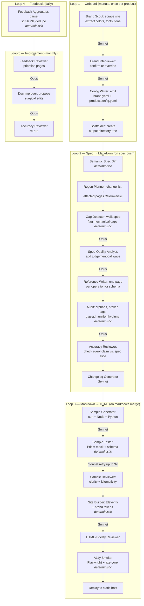

# Case Study: An Agentic Engine for OpenAPI → Developer Portals

> A five-loop pipeline that turns a terse OpenAPI spec into a branded developer portal — with deterministic guard rails on both sides of every LLM call, honest gap handling instead of hallucinated prose, and tested code samples validated against a mock server.

---

## 1. Problem Statement

OpenAPI specs are the contractual source of truth for API behaviour, but they are almost universally terse. Most fields have no `description`. Examples are missing. Units, timezones, defaults, and error codes are implicit. Hand-written documentation goes stale the moment the spec changes, and the gap between "what the spec says" and "what readers need to know" grows with every release.

The naive fix — point a large language model at the spec and ask it to write docs — fails in a specific, predictable way. When the spec is silent, an LLM does not stop; it produces a fluent, plausible sentence. It invents a timezone for a date field. It guesses a default for an optional parameter. It hallucinates an error code the API does not actually emit. None of this is malicious; it is what next-token prediction does when the prompt is missing information.

That makes "good-enough" docs *worse* than no docs, because readers cannot tell the invented sentences apart from the true ones.

**Why this is hard:**

- **Trust is the product.** A reference page that is 95% correct is unusable if you cannot tell which 5% is wrong.
- **The spec is the ground truth, but it is incomplete.** You cannot just suppress the LLM when the spec is silent — readers still need a page for every endpoint.
- **Costs and quality both degrade with context size.** Feeding the whole spec to one mega-agent for every page is expensive and produces worse output than narrow, focused calls.
- **Docs need to stay alive as the spec evolves.** Regenerating everything on every commit is wasteful; regenerating only the right pages requires a real dependency graph.
- **Branding cannot be an afterthought.** Different products need different visual identities, tone, and structure — without forking the engine.

The bet behind this system: **stop trying to fix the LLM. Fix the inputs and outputs around it.** Pre-flight every LLM call with a deterministic gap detector; post-flight every LLM call with a deterministic fidelity reviewer; surface gaps visibly in the output instead of papering over them.

---

## 2. Architecture Overview

The pipeline is decomposed into **five event-triggered loops**, each owning a single transformation:

| # | Loop | Trigger | Output |
|---|------|---------|--------|
| 1 | **Onboard** | Manual: new product registration | A scaffolded product directory with brand tokens, voice, and config |
| 2 | **Spec → Markdown** | Push to `openapi.yaml` | Regenerated reference pages with gap admonitions, a changelog, and a structured gap backlog |
| 3 | **Markdown → HTML** | Push to generated markdown | Tested code samples, a branded static site, accessibility-validated and deployed |
| 4 | **Feedback Ingestion** | Daily cron | Parsed, scrubbed, de-duplicated reader feedback |
| 5 | **Feedback → Improvement** | Monthly cron | Proposed surgical doc edits as pull requests |

Loops 1–3 are implemented. Loops 4–5 are designed but not yet wired.

Each loop is a thin orchestration script that calls a mix of **deterministic steps** (parsing, diffing, planning, auditing, building, testing) and **narrow LLM agents** (writing, reviewing, refining). Every LLM call is bracketed by deterministic gates on the way in and out.

### Diagram

---

## 3. Agent Roster

| Agent Name | Role | Model Used | Why That Model? |
|---|---|---|---|
| Brand Scout (voice) | Read scraped marketing copy, infer tone descriptors and things to avoid | Sonnet | Pattern-recognition on prose |
| Brand Scout (synthesis) | Merge scraped signals into a structured brand payload | Sonnet | Structured-output transformation from a clean input bundle |
| Spec-Quality Analyst | Read the full spec plus deterministic gap list; add judgement-call gaps the detector cannot find | Opus | Whole-spec reasoning, latent-knowledge calls about what readers will actually need |
| Reference Writer | Generate one reference page per operation or schema from a narrow spec slice plus the gap list | Opus | Tone, accuracy, and judgement on how to phrase "the spec is silent" |
| Accuracy Reviewer | Read only the spec slice and rendered markdown; flag any claim not traceable to the spec | Opus | Adversarial reasoning — same model reviewing its own output rationalises errors |
| Changelog Generator | Turn semantic diff output into release notes | Sonnet | Structured input → structured output |
| Spec Fixer | Read open gaps; emit additive YAML overlay fragments | Sonnet | Mechanical transformation from gap record to YAML patch |
| Sample Generator | Produce idiomatic curl, Node, and Python snippets for one operation | Sonnet | Code generation at a well-known abstraction level |
| Sample Reviewer | Check generated samples for clarity and idiomaticity | Sonnet | Pattern matching on code style |
| HTML-Fidelity Reviewer | Verify rendered HTML matches source markdown | Sonnet | Structural comparison rather than judgement |
| Feedback Reviewer *(planned)* | Aggregate reader feedback and produce a prioritised review | Opus | Multi-document synthesis with editorial judgement |
| Doc Improver *(planned)* | Propose surgical edits to a single page from delimited feedback | Opus | Judgement-heavy editing inside tight constraints |

**Model split:** Opus for judgement-heavy or trust-critical work; Sonnet for structured transformations and pattern matching. ~80% of the bill on a cold run is the four Opus roles.

---

## 4. Key Design Decisions

### Deterministic guard rails around every LLM call

The LLM is never the first step and never the last step. Each call is bracketed by deterministic logic.

*Before the LLM:* a deterministic detector walks the spec and emits a structured list of gaps. The LLM's job is no longer "find gaps" — it is "given this list of mechanical gaps, add the judgement-call gaps a parser cannot find."

*After the LLM:* an accuracy reviewer compares the rendered markdown against the spec slice it was generated from. A deterministic audit separately verifies that every gap in the structured backlog has a matching admonition in the page.

*At the output boundary:* every change lands as a pull request. Spec-driven PRs may auto-merge on green CI; feedback-driven PRs require human approval.

### How spec gaps are handled

The rule is absolute: the system never invents prose to cover for a silent spec. When the spec lacks information:

1. A visible admonition appears next to the affected field, telling the reader the spec is silent.
2. A structured record is written to a gap backlog with a stable ID, severity, gap type, and a suggested spec patch.

Running `spec-fix` turns the backlog into a YAML overlay file the spec author can review and merge. On the next run, the detector sees the description now exists and stops emitting the gap; the admonition disappears; coverage goes up.

### How regeneration is scoped to minimise cost

- **Reference pages** live 1:1 with spec nodes. The file path is the dependency declaration — no frontmatter list to maintain.
- **Guide pages** use transclusion tags to declare spec dependencies; the planner scans these tags and rebuilds only affected blocks.

A semantic diff produces a structured list of which nodes changed; the planner intersects that list with the dependency graph; agents are invoked only on the resulting pages. A typical incremental edit (~3 affected pages) costs ~$1.50 instead of ~$11–$12.

---

## 5. Metrics & Results

### Cost

| Scenario | Cost |
|---|---:|
| Cold full run (Loops 1 + 2 + 3) | ~$12 |
| Steady-state spec change, full Loop 2 | ~$11 |
| Incremental spec change (~3 affected pages) | ~$1.50 |
| Markdown merge, Loop 3 only | ~$1.30 |
| **Per-operation rate (cold full regen)** | **~$0.65/op** |

### Tests

| Suite | Count | What it covers |
|---|---:|---|
| Python unit + integration | 167 test functions across 31 files | Spec diff, regen planner, gap detection, writers, samples loop, audit, changelog, overlay generation, onboarding |
| Node / Vitest | 25 test cases across 4 files | Site build, markdown-to-HTML plugins, agent-surfaces manifest |
| End-to-end integration | 4 dedicated files | Loop 1, Loop 2, Loop 3, full-pipeline smoke |
| Accessibility | Playwright + axe-core | WCAG A/AA gate on desktop and mobile viewports |

---

## 6. Tech Stack

- **Python 3.11+** — orchestration, deterministic detectors, audits, planners, CLI surface
- **Node 20+** — static site build (Eleventy 3.x), markdown processing, code-sample mock server
- **Claude CLI in headless mode** — every LLM agent invoked as a subprocess with defined system prompt, tool allow-list, and model selection
- **oasdiff** — OpenAPI semantic diff for structured change lists
- **Prism** — mock OpenAPI server for code sample validation
- **Eleventy** — static site generator
- **Playwright + axe-core** — accessibility validation
- **GitHub Actions** — CI for spec-change, site-build, and test runs
- **GitHub Pages** — default static hosting target (configurable per product)
- **pytest + Vitest** — test runners

---

## 7. What I'd Do Differently

**Cold subprocess calls cost more than needed.** Every agent invocation re-pays a ~7K-token harness. Migrating to a long-running session with explicit prompt caching would cut Loop 2 input tokens by 30–50%.

**Tighter output contracts on more agents.** Several agents return prose-heavy responses where a strict JSON schema would be safer. The audit and reviewer steps catch failure modes today, but pushing more agents toward structured output would let downstream code branch on structure rather than parse free text.

**The two loops still on paper need to ship sooner.** The feedback loops (4 and 5) are fully designed but not yet wired. Ship the simplest possible version of Loop 4 first so the dataset shape informs the LLM step rather than the other way around.

**The "honest gap" decision is unambiguously right, and was the hardest sell.** Early prototypes hid silent-spec cases with neutral-sounding prose. Surfacing gaps as styled admonitions felt like making an ugly UI on purpose. In practice, it makes the output usable: readers learn to trust everything outside the admonitions, and spec authors get a real backlog.

**Two model tiers, not one or three.** Opus for judgement work and Sonnet for transformations was the right call. Trying to use Opus everywhere would have made the bill 3–4× higher with no quality gain. Pushing Opus roles to Sonnet measurably degraded the accuracy reviewer's catch rate.

---

*Source is private (personal project) — available on request.*
